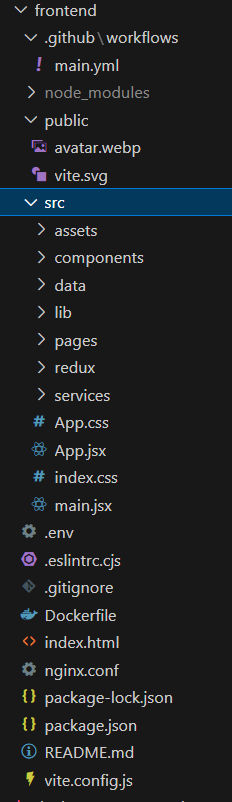

# MyBank - React Application

MyBank is a modern banking application built with React, Vite, and Tailwind CSS. This application provides a user-friendly interface for banking operations.

## Project Structure




## Prerequisites

Before running the application, ensure you have:
- Node.js (v16 or higher recommended)
- npm (comes with Node.js) or yarn
- Docker (optional, for containerized deployment)

## Getting Started

### 1. Install dependencies
```bash
npm install
```

### 2. Environment Setup
Create a `.env` file in the root directory with your environment variables.

### 3. Development
```bash
npm run dev
```
Access the app at `http://localhost:3000`


## Deployment Options

### Docker Deployment
1. Build the Docker image:
```bash
docker build -t mybank-frontend .
```

2. Run the container:
```bash
docker run -p 3000:80 mybank-frontend
```

### Nginx Deployment
The project includes an `nginx.conf` configuration for production deployment.

## Key Features

- Modern React architecture with Vite
- State management with Redux
- Containerized deployment with Docker
- CI/CD ready (GitHub Actions configured)
- Linting with ESLint
- Responsive design with Tailwind CSS

## Available Scripts

- `dev`: Starts development server
- `build`: Creates production build
- `lint`: Runs ESLint for code quality

## Dependencies

See `package.json` for complete list. Key dependencies include:
- React 18
- Vite
- Redux Toolkit
- Axios
- Tailwind CSS
- React Router

